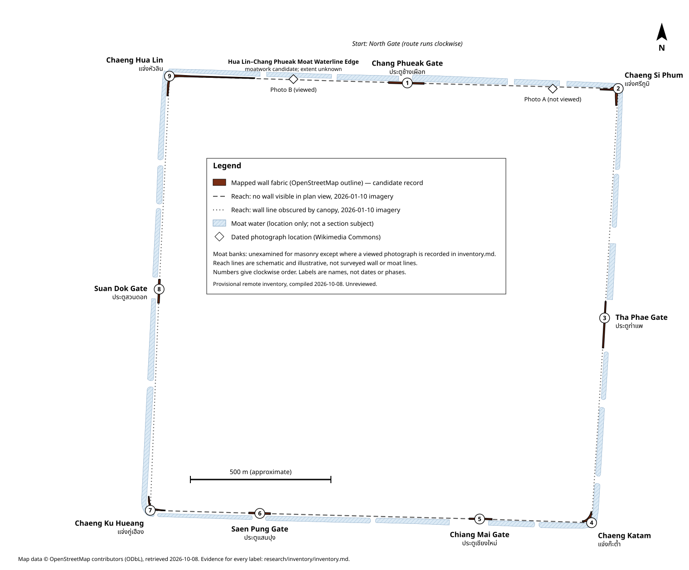

# Provisional full-circuit inventory

Status: **provisional, remote, unreviewed.** Compiled 2026-10-08 for issue #3. Revised 2026-10-08 for issue #23: every wall candidate re-examined segment by segment ([`evidence.md`](evidence.md)); Chang Phueak Gate and Chaeng Ku Hueang split. This is research staging, not book content. Nobody visited, measured or photographed any site for the issue #3 compilation. A coordinating AI agent read maps, dated satellite imagery, dated photographs and written sources. The issue #23 revision adds two owner photographs of the Chang Phueak Gate east wing, taken on site on 2026-10-08; they are the only ground observation in this file.

It names candidate subjects and shows where evidence is missing. It does not fix a chapter count, a phase count or any construction date.

- Map: [`inventory-map.svg`](inventory-map.svg) (north up). Data behind it: [`inventory-map.geojson`](inventory-map.geojson). Re-render with `python3 research/inventory/render_map.py` from the repository root.
- Segment-by-segment evidence for the nine stops: [`evidence.md`](evidence.md). Evidence ids (I1–I11, O1–O4) refer to it.
- Sources: [`../shared/sources/register.md`](../shared/sources/register.md). Source keys in this file refer to it.
- Names: [`../shared/names.md`](../shared/names.md).
- Attributed dates: [`../shared/chronology.md`](../shared/chronology.md).
- Stage handoff and review questions: [`handoff.md`](handoff.md).

## Clockwise list

Start at the North Gate and go clockwise. Every stop below carries mapped wall fabric. Between the stops, no wall fabric was seen; see the coverage table for what that does and does not mean.

| # | Name | Thai | Type | What the remote evidence shows | Status |
| - | ---- | ---- | ---- | ------------------------------ | ------ |
| 1 | [Chang Phueak Gate](#chang-phueak-gate) | ประตูช้างเผือก | Gate, wall fabric | Two wings either side of a road opening; each wing has two visibly different sections | Split into 1a–1d |
| 1a | [Chang Phueak Gate West Wing, West Section](#chang-phueak-gate-west-wing-west-section) | – | Wall fabric | Ragged-edged run, 37 m | Candidate; unresolved |
| 1b | [Chang Phueak Gate West Wing, Gate Section](#chang-phueak-gate-west-wing-gate-section) | – | Wall fabric | Straight-edged block beside the gate, 17 m | Candidate; unresolved |
| 1c | [Chang Phueak Gate East Wing, Gate Section](#chang-phueak-gate-east-wing-gate-section) | – | Wall fabric | Crenellated, evenly coursed block beside the gate, 18 m | Candidate; unresolved |
| 1d | [Chang Phueak Gate East Wing, East Section](#chang-phueak-gate-east-wing-east-section) | – | Wall fabric | Low, ragged-topped run, 24 m | Candidate; unresolved |
| 2 | [Chaeng Si Phum](#chaeng-si-phum) | แจ่งศรีภูมิ | Corner, wall fabric | Corner structure, and a wall run south from it | Candidate; unresolved composite |
| 3 | [Tha Phae Gate](#tha-phae-gate) | ประตูท่าแพ | Gate, wall fabric | Two wall runs either side of an opening, onto a plaza | Candidate; unresolved composite |
| 4 | [Chaeng Katam](#chaeng-katam) | แจ่งก๊ะต้ำ | Corner, wall fabric | Corner structure projecting into the moat | Candidate; unresolved composite |
| 5 | [Chiang Mai Gate](#chiang-mai-gate) | ประตูเชียงใหม่ | Gate, wall fabric | Two wall blocks either side of a road opening | Candidate; unresolved composite |
| 6 | [Saen Pung Gate](#saen-pung-gate) | ประตูแสนปุง | Gate, wall fabric | Two wall blocks either side of a road opening | Candidate; unresolved composite |
| 7 | [Chaeng Ku Hueang](#chaeng-ku-hueang) | แจ่งกู่เฮือง | Corner, wall fabric | Corner structure, with wall runs north and east | Split into 7a–7b |
| 7a | [Chaeng Ku Hueang Corner and Adjoining Runs](#chaeng-ku-hueang-corner-and-adjoining-runs) | – | Corner, wall fabric | Rounded corner, north run, and the narrow part of the east run | Candidate; unresolved composite |
| 7b | [Chaeng Ku Hueang East Run, East Section](#chaeng-ku-hueang-east-run-east-section) | – | Wall fabric | Wider, straight-edged end of the east run, 19 m | Candidate; unresolved |
| 8 | [Suan Dok Gate](#suan-dok-gate) | ประตูสวนดอก | Gate, wall fabric | Mapped wall either side of the opening; largely hidden by trees | Candidate; unresolved composite |
| 9 | [Chaeng Hua Lin](#chaeng-hua-lin) | แจ่งหัวลิน | Corner, wall fabric | Corner structure, a long wall run east and a shorter run south | Candidate; unresolved composite; boundary seen, not placed |
| – | [Hua Lin–Chang Phueak Moat Waterline Edge](#hua-linchang-phueak-moat-waterline-edge) | – | Moatwork, bank side unresolved | A constructed edge at the waterline in a 2017 photograph | Candidate; unresolved |

Then back to the North Gate.

Notes on the list:

- "Composite" means the record may hold more than one construction phase. Sources already disagree about which parts are old (see each record).
- A split record keeps its entry, marked as split, and lists its children. A child is split off where a boundary along the wall is visible in at least one inspected source and can be placed. The boundary says that the fabric changes there. It does not say which side is older, and no child has a date.
- Section names describe position and form only. Child names have no Thai form; they are editorial names, not official ones.
- "Corner structure" describes a shape seen from above. It does not claim that the structure is a bastion of any period.
- Two names on this list (Chaeng Katam, Saen Pung Gate) have spelling or naming variants that need a decision. See [`../shared/names.md`](../shared/names.md).

## Coverage of the whole route

Every part of the route has a status. A status describes this investigation, not the site.

Status terms:

- **fabric mapped**: wall fabric is outlined in OpenStreetMap and visible in the 2026-01-10 image.
- **none visible**: the agent inspected the 2026-01-10 image and saw no wall fabric along the city side of the moat. Low or buried remains, or remains under trees, could still exist. This is not evidence of absence.
- **obscured**: tree canopy hides the line of the wall in the 2026-01-10 image. Nothing can be said.
- **unexamined**: nobody has looked. A satellite image cannot show the vertical face of a moat bank, so both banks are unexamined except at the two photographs.

| Stretch, clockwise | Wall line | City-side bank | Outer-side bank |
| ------------------ | --------- | -------------- | --------------- |
| 1 Chang Phueak Gate | fabric mapped | unexamined | unexamined |
| Chang Phueak Gate to Chaeng Si Phum | none visible | unexamined | unexamined (photo A, commons-linge-20170329-1143a, exists; not viewed) |
| 2 Chaeng Si Phum | fabric mapped | unexamined | unexamined |
| Chaeng Si Phum to Tha Phae Gate | obscured | unexamined | unexamined |
| 3 Tha Phae Gate | fabric mapped | unexamined | unexamined |
| Tha Phae Gate to Chaeng Katam | obscured | unexamined | unexamined |
| 4 Chaeng Katam | fabric mapped | unexamined | unexamined |
| Chaeng Katam to Chiang Mai Gate | none visible | unexamined | unexamined |
| 5 Chiang Mai Gate | fabric mapped | unexamined | unexamined |
| Chiang Mai Gate to Saen Pung Gate | none visible | one bank, side not established: constructed waterline edge seen in commons-linge-20170329-1029a (not on the map: no camera position stated) | same observation; side not established |
| 6 Saen Pung Gate | fabric mapped | unexamined | unexamined |
| Saen Pung Gate to Chaeng Ku Hueang | none visible | unexamined | unexamined |
| 7 Chaeng Ku Hueang | fabric mapped | unexamined | unexamined |
| Chaeng Ku Hueang to Suan Dok Gate | obscured | unexamined | unexamined |
| 8 Suan Dok Gate | fabric mapped, mostly under canopy | unexamined | unexamined |
| Suan Dok Gate to Chaeng Hua Lin | obscured | unexamined | unexamined |
| 9 Chaeng Hua Lin | fabric mapped | unexamined | unexamined |
| Chaeng Hua Lin to Chang Phueak Gate | none visible | unexamined (the photographer stood on this bank) | constructed waterline edge seen in photo B, commons-linge-20170329-1201a; side inferred, unresolved (see the waterline-edge record) |

Evidence for the wall-line column: the agent's reading of esri-world-imagery-wv3-2026-01-10, recorded per stretch in [Observations of the 2026-01-10 image](#observations-of-the-2026-01-10-image). The difference between "none visible" and "obscured" is the agent's judgement of canopy cover. A human should check it.

The moat water itself is not a subject. It appears on the map only to locate the banks.

## Candidate records

Each record uses the fields of the planning document's inventory table. "Evidence" gives source keys and exact locators. Positions are WGS 84 latitude and longitude.

Fields common to all nine wall records, stated once here:

- **Observation**: observer is the coordinating AI agent, reading esri-world-imagery-wv3-2026-01-10 (image date 2026-01-10, vendor-stated resolution 0.31 m and accuracy 8.47 m). Viewpoint is vertical. The first reading (issue #3) used the service's export at about 0.3 m per pixel. The second reading (issue #23, 2026-10-08) used zoom-19 tiles, segment by segment along each outline; its entries are in [`evidence.md`](evidence.md). A human dated observation exists for Chang Phueak Gate's east wing only (owner photographs, 2026-10-08).
- **Commons photographs**: every candidate identification photograph named below was requested again on 2026-10-08 for issue #23. Each file page loaded; each image request returned HTTP 429. None has been viewed. See [`evidence.md`](evidence.md), "Commons photographs: fetch record".
- **Position, coordinate source and accuracy**: outline from the named OpenStreetMap ways (osm-api-2026-10-08). OpenStreetMap states no accuracy for them. At Chaeng Hua Lin, Chang Phueak Gate and Chaeng Ku Hueang the agent overlaid the outlines on the 2026-01-10 image; they fell on the visible brick fabric, offset by a few metres at most. That is within the image's stated 8.47 m accuracy. The other six were not overlaid. Dimensions below are the north–south and east–west spans of the OSM outline, computed by the agent, and rounded to the metre. They are not measurements of the fabric.
- **Phases**: no phase is established for any record. Each record lists the claims that exist, so that pilot research can test them.
- **Access**: not verified for any record. The route order is a reading order, not a claim that a safe continuous footpath exists.
- **Rights**: no image is reproduced. The map outline is OpenStreetMap data (ODbL 1.0, attribution "© OpenStreetMap contributors"). Candidate identification photographs are named in the record, with their stated licences, but none is cleared for the book.

### Chang Phueak Gate

- **Identity**: Chang Phueak Gate, ประตูช้างเผือก. Gate with wall fabric. Official-name status: the Thai name is the one thestandard-686272 uses in its report of the Fine Arts Office 7 inspection, and is OSM's `name`; no official document was seen. Former name ประตูหัวเวียง (th-wikipedia-wall-r13016262, inner-gates section). The route's "North Gate" (see names.md).
- **Position**: route order 1, north side. Two blocks, west and east of a road opening. OSM ways [24871597](https://www.openstreetmap.org/way/24871597) (west; spans about 7 m × 54 m) and [97191493](https://www.openstreetmap.org/way/97191493) (east; about 7 m × 41 m). Gate node [11229077788](https://www.openstreetmap.org/node/11229077788) at 18.79543, 98.98659.
- **Observation, 2026-01-10**: two brick-coloured blocks stand on the city side of the moat either side of the road, with shadows that show height. Nothing between the blocks.
- **Extent**: each block's ends are the OSM outline. Adjacent: the stretches to Chaeng Hua Lin (west) and Chaeng Si Phum (east), where no wall is visible.
- **Phases, claims to test**: (a) the part that fell in September 2022 was a wall built "ช่วงต้นปี 2500" to cover the old wall line, and the old wall behind it was not damaged (Fine Arts Office 7 official, thestandard-686272); (b) the fallen wall was not bonded to the gate structure (thaipbs-319794); (c) the gate was rebuilt "2503-2512" (unattributed narration, thestandard-686272); (d) all five gates were newly built by the municipality about eighty years before an undated post (thaipbs-319832). Claims (a) and (b) imply at least an outer casing and an older core. Their number and extent are not established. Excavations were reported in 2009 (mgronline-9520000066170, extractor) and after the 2022 collapse (thaipbs-336746, extractor); no report was found.
- **Condition**: about 10 m of wall fell on 25 September 2022 (nation-40020399). On 2026-01-10 both blocks stand; whether and how the fallen part was rebuilt is not established.
- **Evidence**: as cited above. Candidate identification photographs: Commons files "201703291151b P Chiang Mai, City Wall, Chang Phuak Gate.jpg" (2017-03-29) and "Ancient city wall and Chang Phueak Gate in Chiang Mai.jpg" (2009, stated public domain); both predate the 2022 collapse, and neither was viewed (HTTP 429, 2026-10-08).
- **Owner observations, 2026-10-08**: the owner reported that each side "has two very visibly different sections, older and newer", that "the older sections may not all be from one era", and that "there may be as many as three sections per side" (O1, [#4](https://github.com/jmcvetta/chiang-mai-wall-book/issues/4#issuecomment-6064637049)). Reading a zoom-19 crop of the west wing, the owner said: "the restored section is quite square, whereas the older section is uneven and ragged" (O2, [#4](https://github.com/jmcvetta/chiang-mai-wall-book/issues/4#issuecomment-6064700401)). The owner photographed the east wing's section border from across Sri Phum Road (O3, O4; files in `research/materials/owner-photos/`). These are owner observations. "Older", "newer" and "restored" are the owner's words, not sourced claims.
- **Segment observation, 2026-10-08**: in each wing the zoom-19 imagery shows a straight-edged, wider block next to the gate and a narrower, ragged-edged run beyond it (I1, I2). In the east wing the block is under canopy; the owner photographs show it as a crenellated block of evenly coursed brick that stands forward of a much lower, ragged-topped run, with an abrupt join (O3, O4). Inspected: zoom-19 imagery (both wings), owner photographs (east wing). Not inspected: the two Commons photographs above (HTTP 429).
- **Status**: **split 2026-10-08** into [1a](#chang-phueak-gate-west-wing-west-section), [1b](#chang-phueak-gate-west-wing-gate-section), [1c](#chang-phueak-gate-east-wing-gate-section) and [1d](#chang-phueak-gate-east-wing-east-section). This record stays as the parent and holds the gate's identity, name and the claims (a)–(d). The name "Chang Phueak Gate" is not reassigned to any child. No source names which section claims (a)–(d) concern, so none is linked to a child. Further splits within a child are possible (O1 allows up to three sections per side) and are not established.

#### Chang Phueak Gate West Wing, West Section

- **Identity**: route ref 1a. Editorial descriptive name. Wall fabric. Parent: Chang Phueak Gate.
- **Position**: OSM way [24871597](https://www.openstreetmap.org/way/24871597), the part west of 98.98630 E: from the wing's west end for 37 m.
- **Observation, 2026-01-10 image, read 2026-10-08**: a narrow band with a wandering moat-side edge, a mottled top and a broken shadow line (I1). Owner: "uneven and ragged" (O2).
- **Extent**: west end as mapped. East end at the boundary with 1b: 37 m from the west end of the outline, ± 3 m along the outline, placed from I1. Whether this run holds more than one section is not established.
- **Phases, claims to test**: the parent's claims (a)–(d) may apply; no source places them here.
- **Condition**: not established beyond the plan view.
- **Evidence**: I1, O1, O2.
- **Status**: candidate; unresolved.

#### Chang Phueak Gate West Wing, Gate Section

- **Identity**: route ref 1b. Editorial descriptive name. Wall fabric. Parent: Chang Phueak Gate.
- **Position**: OSM way [24871597](https://www.openstreetmap.org/way/24871597), the part east of 98.98630 E: the last 17 m of the wing, to the gate opening.
- **Observation, 2026-01-10 image, read 2026-10-08**: a wider block with two straight parallel edges, a sharp straight shadow on the road side and a lighter strip along its top (I1). Owner: "quite square" (O2).
- **Extent**: west end at the boundary with 1a (37 m from the west end of the outline, ± 3 m); east end at the gate opening, as mapped. Where this block ends and the gate structure begins is not established.
- **Phases, claims to test**: the parent's claims (a)–(d) may apply; no source places them here.
- **Condition**: not established beyond the plan view.
- **Evidence**: I1, O1, O2.
- **Status**: candidate; unresolved.

#### Chang Phueak Gate East Wing, Gate Section

- **Identity**: route ref 1c. Editorial descriptive name. Wall fabric. Parent: Chang Phueak Gate.
- **Position**: OSM way [97191493](https://www.openstreetmap.org/way/97191493), the part west of 98.98692 E: the first 17.5 m of the wing from the gate opening.
- **Observation, 2026-01-10 image, read 2026-10-08**: under tree canopy; a straight road-side edge and shadow show at the canopy's south edge (I2). **Observation, 2026-10-08 23:52 local, owner photographs**: a tall block of evenly coursed brick with crenellations along the top, a large tree over it, its face forward of the run to the east (O3, O4).
- **Extent**: west end at the gate opening, as mapped. East end at the boundary with 1d, 17.5 m from the west end of the outline, ± 3 m along the outline; placed from the step in the road-side edge in I2 and consistent with the block's corner in O4.
- **Phases, claims to test**: the parent's claims (a)–(d) may apply; no source places them here.
- **Condition**: standing on 2026-10-08 (O3).
- **Evidence**: I2, O1, O3, O4.
- **Status**: candidate; unresolved.

#### Chang Phueak Gate East Wing, East Section

- **Identity**: route ref 1d. Editorial descriptive name. Wall fabric. Parent: Chang Phueak Gate.
- **Position**: OSM way [97191493](https://www.openstreetmap.org/way/97191493), the part east of 98.98692 E: from the boundary with 1c to the wing's east end, 24 m.
- **Observation, 2026-01-10 image, read 2026-10-08**: a narrower, lighter, uneven band with a ragged moat-side edge (I2). **Observation, 2026-10-08 23:52 local, owner photographs**: a low run of brick, about half the height of 1c, with uneven courses and a ragged, stepped top; a sign in front reads "Please do not climb on the historical ruins" (O3, O4). The run's east end is out of frame.
- **Extent**: west end at the boundary with 1c (± 3 m); east end as mapped. Whether this run holds more than one section is not established.
- **Phases, claims to test**: the parent's claims (a)–(d) may apply; no source places them here. The sign's wording is not a dating claim.
- **Condition**: standing on 2026-10-08 (O3).
- **Evidence**: I2, O1, O3, O4.
- **Status**: candidate; unresolved.

### Chaeng Si Phum

- **Identity**: Chaeng Si Phum, แจ่งศรีภูมิ. Corner, wall fabric. Former name แจ่งสะหลีภูมิ (th-wikipedia-wall-r13016262, corners section). Official-name status: Thai name used by Wikipedia and OSM; no official document seen.
- **Position**: route order 2, north-east corner. OSM way [263459882](https://www.openstreetmap.org/way/263459882) (about 66 m × 70 m; tagged `historic=ruins`, `source=Bing;local knowledge;Esri`).
- **Observation, 2026-01-10**: a corner structure under heavy canopy, and a brick-coloured wall line running south from it along the city side of the east moat. Its south end is not distinct from the canopy.
- **Extent**: the OSM outline includes the corner and the start of both runs. Where the corner ends and a wall run begins is not established; it is mapped as one outline.
- **Phases, claims to test**: none specific to this corner was found, except travel-site assertions that it is original (see discovery-other-languages.md, `visitthailandtoday-corners`), which are not evidence.
- **Condition**: not established beyond the plan view.
- **Evidence**: as cited. Candidate identification photographs: Commons category [Si Phum Corner](https://commons.wikimedia.org/wiki/Category:Si_Phum_Corner) (24 files, including the 29 March 2017 Linge series); none viewed. The category was not opened in the 2026-10-08 pass, because every Commons image request returned HTTP 429.
- **Segment observation, 2026-10-08**: uneven reddish-brown fabric at the corner tip; the south run a narrow band; most of the outline under heavy canopy. No boundary visible (I3). Inspected: zoom-19 imagery. Not inspected: any photograph.
- **Status**: candidate; unresolved composite. Kept composite: no boundary visible, but canopy hides more than half the outline.

### Tha Phae Gate

- **Identity**: Tha Phae Gate, ประตูท่าแพ. Gate with wall fabric. Former name ประตูเชียงเรือก; called ประตูท่าแพชั้นใน to distinguish it from a former outer gate (th-wikipedia-wall-r13016262). OSM `name` ประตูท่าแพ.
- **Position**: route order 3, east side. OSM ways [263464175](https://www.openstreetmap.org/way/263464175) (north run; about 66 m × 8 m) and [263464174](https://www.openstreetmap.org/way/263464174) (south run; about 95 m × 10 m), members of multipolygon relation [6115913](https://www.openstreetmap.org/relation/6115913) (`historic=citywalls`). Gate node [1017379824](https://www.openstreetmap.org/node/1017379824).
- **Observation, 2026-01-10**: a wall line north and south of an opening, with an open plaza to its east.
- **Extent**: as mapped. Whether the two runs and the gate opening are one construction is not established.
- **Phases, claims to test**: the gate was newly built by the municipality and the Fine Arts Department in พ.ศ. 2528 (text) or 2529 (infobox) (th-wikipedia-tha-phae-r12962538); reconstructed 1985–1986 or 1985–1987, after a renovation in 1966–1967 (en-wikipedia-tha-phae-r1360504006); rebuilt with Fine Arts permission following an old photograph in พ.ศ. 2529 (thaipbs-319832). The sources do not say whether the flanking runs were part of that rebuilding.
- **Condition**: not established beyond the plan view.
- **Evidence**: as cited. Candidate identification photographs: "201703291114c Chiang Mai, City Wall, Tha Phae Gate.jpg" (2017-03-29) and "20171105 Tha Phae Gate Chiang Mai 9784 DxO.jpg" (2017-11-05, CC BY-SA 4.0 stated); neither viewed (HTTP 429, 2026-10-08).
- **Segment observation, 2026-10-08**: the north run shows a regular toothed shadow, consistent with crenellation, along its whole 66 m with no change (I4). The south run's north 35 m is a narrow straight band without that shadow pattern; the rest is under canopy (I5). No boundary visible within either run. Inspected: zoom-19 imagery. Not inspected: the two photographs above.
- **Status**: candidate; unresolved composite. Kept composite: no boundary visible within either run; two-thirds of the south run is under canopy.

### Chaeng Katam

- **Identity**: Chaeng Katam, แจ่งก๊ะต้ำ (also แจ่งขะต๊ำ, Wikipedia; แจ่งก๊ะต๊ำ, OSM). Corner, wall fabric. The official spelling is not established.
- **Position**: route order 4, south-east corner. OSM way [791602197](https://www.openstreetmap.org/way/791602197) (about 41 m × 34 m; tagged `historic=ruins`).
- **Observation, 2026-01-10**: a corner structure projecting into the moat at the corner, partly under canopy. No wall run is distinct from it in either direction.
- **Extent**: as mapped.
- **Phases, claims to test**: none found.
- **Condition**: not established beyond the plan view.
- **Evidence**: as cited. Candidate identification photograph: "201703291051a Chiang Mai, City Wall, Katam Corner.jpg" (2017-03-29); not viewed (HTTP 429, 2026-10-08). A shrine at the corner (ศาลเจ้าพ่อหลักเมืองแจ่งกระต๊ำ, OSM node 11226861564) is not wall fabric and is not a subject.
- **Segment observation, 2026-10-08**: a curved band along the road, straight arms along both moats, and at the corner a lighter, uneven, reddish-brown area that matches the outline's projecting lobe (I6). Inspected: zoom-19 imagery. Not inspected: the photograph above.
- **Boundary note**: the change in tone and texture at the corner lobe is visible. It is not treated as a section boundary. From above it is consistent with the top surface of a corner platform against its parapets, which is a difference of form; a plan view cannot show whether the masonry differs. A dated photograph of the corner's faces would decide it.
- **Status**: candidate; unresolved composite.

### Chiang Mai Gate

- **Identity**: Chiang Mai Gate, ประตูเชียงใหม่. Gate with wall fabric. Former name ประตูท้ายเวียง (th-wikipedia-wall-r13016262).
- **Position**: route order 5, south side. OSM ways [330870296](https://www.openstreetmap.org/way/330870296) (west; about 5 m × 23 m) and [330870295](https://www.openstreetmap.org/way/330870295) (east; about 7 m × 41 m). Gate node [6107975995](https://www.openstreetmap.org/node/6107975995).
- **Observation, 2026-01-10**: two blocks on the city side either side of a road opening.
- **Extent**: as mapped.
- **Phases, claims to test**: "Built c.1296 at the founding of the city by King Mangrai." / "Reconstructed c.1800. Rebuilt 1966-1969." (wikivoyage-chiang-mai; extractor; uncited). The first date concerns the first gate on the site, not the standing blocks. The eighty-years claim for all five gates (thaipbs-319832) also applies.
- **Condition**: not established beyond the plan view.
- **Evidence**: as cited. Candidate identification photograph: "201703291042a Chiang Mai, City Wall, Chiang Mai Gate.jpg" (2017-03-29); not viewed (HTTP 429, 2026-10-08).
- **Segment observation, 2026-10-08**: the west block is a uniform rectangle in shadow, with no change along it. The east block shows a light top for its first 5–6 m from the gate, a lighter patterned top to about 13 m, then shadow and canopy (I7). Inspected: zoom-19 imagery. Not inspected: the photograph above.
- **Boundary note**: the change about 6 m from the gate in the east block may be the gate pier against the wall. It cannot be told apart in this image, so it is not placed.
- **Status**: candidate; unresolved composite. Kept composite: no placeable boundary; shadow and canopy hide about 28 m of the east block.

### Saen Pung Gate

- **Identity**: Saen Pung Gate, ประตูแสนปุง, also ประตูสวนปรุง (Suan Prung Gate). Gate with wall fabric. Wikipedia gives an earlier name ประตูสวนแร (th-wikipedia-wall-r13016262). Which name is official is not established; Commons uses "Suan Prung", OSM uses แสนปุง.
- **Position**: route order 6, south side, west of Chiang Mai Gate. OSM ways [1211639140](https://www.openstreetmap.org/way/1211639140) (west; about 6 m × 27 m) and [1211639141](https://www.openstreetmap.org/way/1211639141) (east; about 7 m × 27 m). Gate node [11226724529](https://www.openstreetmap.org/node/11226724529).
- **Observation, 2026-01-10**: two short blocks either side of a road opening.
- **Extent**: as mapped.
- **Phases, claims to test**: the eighty-years claim for all five gates (thaipbs-319832). Wikipedia's statement that the gate was cut through the wall in a later reign concerns the first opening on the site, not the standing blocks.
- **Condition**: not established beyond the plan view.
- **Evidence**: as cited. Candidate identification photograph: "201703281525c Chiang Mai, City Wall, Suan Prung Gate.jpg" (2017-03-28); not viewed (HTTP 429, 2026-10-08).
- **Segment observation, 2026-10-08**: both blocks are almost entirely in shadow and under canopy; only about 7 m of the west block shows a top surface (I8). Inspected: zoom-19 imagery. Not inspected: the photograph above.
- **Status**: candidate; unresolved composite. Left unresolved for want of a viewable source: the imagery cannot be read, and the photograph could not be fetched.

### Chaeng Ku Hueang

- **Identity**: Chaeng Ku Hueang, แจ่งกู่เฮือง. Corner, wall fabric. Commons uses "Ku Ruang" and "Ku Huang".
- **Position**: route order 7, south-west corner. OSM way [317516851](https://www.openstreetmap.org/way/317516851) (about 58 m × 60 m).
- **Observation, 2026-01-10**: a rounded corner structure projecting into the moat, with wall runs north along the west moat and east along the south moat. The overlaid OSM outline follows them.
- **Extent**: the outline includes the corner and both runs. Their boundary is an uncertain zone.
- **Phases, claims to test**: "Rebuilt c. 1800" (wikivoyage-chiang-mai; extractor; uncited).
- **Condition**: not established beyond the plan view.
- **Evidence**: as cited. Candidate identification photograph: "201703281534c P Chiang Mai, City Moat, Ku Ruang Corner.jpg" (2017-03-28); not viewed (HTTP 429, 2026-10-08).
- **Segment observation, 2026-10-08**: a rounded corner with a flat light-brown top, a narrow north run with uneven edges, and an east run that is narrow with uneven edges as far as 41 m from the outline's west end, then wider with straight parallel edges and a straight shadow to its east end. A light cross-line marks the change (I9). Inspected: zoom-19 imagery. Not inspected: the photograph above.
- **Boundary note**: the rounded corner's flat top differs in form from the runs. As at Chaeng Katam, that is not treated as a section boundary.
- **Status**: **split 2026-10-08** into [7a](#chaeng-ku-hueang-corner-and-adjoining-runs) and [7b](#chaeng-ku-hueang-east-run-east-section). This record stays as the parent and holds the name and the claim "Rebuilt c. 1800", which no source places on either child. The name "Chaeng Ku Hueang" is not reassigned to a child.

#### Chaeng Ku Hueang Corner and Adjoining Runs

- **Identity**: route ref 7a. Editorial descriptive name. Corner and wall fabric. Parent: Chaeng Ku Hueang.
- **Position**: OSM way [317516851](https://www.openstreetmap.org/way/317516851), the part west of 98.97823 E: the corner, the north run, and the east run for 41 m from the outline's west end.
- **Observation, 2026-01-10 image, read 2026-10-08**: rounded corner with a flat top; narrow runs with uneven edges (I9).
- **Extent**: as mapped, except the east end, which is the boundary with 7b at 41 m from the outline's west end, ± 3 m along the outline. Where the corner ends and each run begins is not established.
- **Phases, claims to test**: the parent's claim may apply; no source places it here.
- **Condition**: not established beyond the plan view.
- **Evidence**: I9.
- **Status**: candidate; unresolved composite.

#### Chaeng Ku Hueang East Run, East Section

- **Identity**: route ref 7b. Editorial descriptive name. Wall fabric. Parent: Chaeng Ku Hueang.
- **Position**: OSM way [317516851](https://www.openstreetmap.org/way/317516851), the part east of 98.97823 E: the last 19 m of the east run.
- **Observation, 2026-01-10 image, read 2026-10-08**: wider than the run to its west, with straight parallel edges and a straight shadow (I9).
- **Extent**: west end at the boundary with 7a (± 3 m); east end as mapped.
- **Phases, claims to test**: the parent's claim may apply; no source places it here.
- **Condition**: not established beyond the plan view.
- **Evidence**: I9. The light cross-line at the boundary could be a path or a gap rather than a joint; a dated photograph would decide it.
- **Status**: candidate; unresolved.

### Suan Dok Gate

- **Identity**: Suan Dok Gate, ประตูสวนดอก. Gate with wall fabric.
- **Position**: route order 8, west side. OSM ways [473546718](https://www.openstreetmap.org/way/473546718) (south of the opening; about 45 m × 8 m) and [323670037](https://www.openstreetmap.org/way/323670037) (north; about 18 m × 7 m). Gate node [6717438786](https://www.openstreetmap.org/node/6717438786).
- **Observation, 2026-01-10**: the gate area is largely under canopy. The agent could not confirm the mapped fabric in the image. The record rests on the OSM outline and the news items below.
- **Extent**: as mapped; confirmed in part by the 2026-10-08 reading (see below).
- **Phases, claims to test**: "The ancient gates and walls were restored in 1818" (nation-40027862); "Renovated ... in 1821" (citylife-suan-dok-2023). These name a campaign for the gates generally, not the standing fabric here. The eighty-years claim for all five gates (thaipbs-319832) also applies.
- **Condition**: a two-metre vertical crack "on the north side of the gate", and the wall "supported by a mound of earth" (nation-40027862, 21 May 2023).
- **Evidence**: as cited. Candidate identification photograph: "201703291225a P Chiang Mai, City Wall, Saun Dok Gate.jpg" (2017-03-29); not viewed (HTTP 429, 2026-10-08).
- **Segment observation, 2026-10-08**: the zoom-19 tiles confirm mapped fabric in two places the first reading could not: a straight-edged rectangle in the south 12 m of way 473546718, and a straight-edged block along all of way 323670037. The rest of way 473546718 is under canopy. No boundary visible (I10). Inspected: zoom-19 imagery. Not inspected: the photograph above.
- **Status**: candidate; unresolved composite. Kept composite: no boundary visible; canopy hides most of way 473546718.

### Chaeng Hua Lin

- **Identity**: Chaeng Hua Lin, แจ่งหัวลิน. Corner, wall fabric. Commons also uses "Hua Rin".
- **Position**: route order 9, north-west corner. OSM way [317516852](https://www.openstreetmap.org/way/317516852) (about 78 m × 313 m; tagged `historic=ruins`, `material=brick`).
- **Observation, 2026-01-10**: a corner structure at the corner of the moat, a long wall run east along the city side of the north moat, and a shorter run south along the west moat. The overlaid OSM outline follows them.
- **Extent**: one OSM outline covers the corner and both runs. The outline spans 313 m east–west and 78 m north–south, the corner included. Where the corner ends and the east run begins is not established.
- **Possible split**: the east run may be a separate subject from the corner. No evidence decides it. If research separates them, the run needs its own descriptive name, for example one built from "Chaeng Hua Lin", "North" and "Wall"; the existing name stays with the corner. That example is an illustration, not an adopted name.
- **Phases, claims to test**: none specific found.
- **Condition**: not established beyond the plan view.
- **Evidence**: as cited. Candidate identification photograph: "201703291209c Chiang Mai, City Wall, Hua Lin Corner.jpg" (2017-03-29); not viewed (HTTP 429, 2026-10-08).
- **Segment observation, 2026-10-08**: a rounded corner with a light top; a uniform south run; along the east run, measured from the outline's west end, a continuous band with a straight shadow to about 63 m, canopy from about 63 m to 160 m, an intermittent band with gaps from about 160 m to 270 m, and a reddish, uneven band from about 275 m to the east end (I11). Inspected: zoom-19 imagery. Not inspected: the photograph above.
- **Boundary note**: the east run changes in character along its length, but the first change falls under the canopy between about 63 m and 160 m and cannot be placed. The change between the intermittent band and the reddish band near 270–275 m is not distinct enough to place either. One record is kept. The corner's rounded top differs in form from the runs; as at Chaeng Katam, that is not treated as a section boundary.
- **Status**: candidate; unresolved composite; boundary seen, not placed.

### Hua Lin–Chang Phueak Moat Waterline Edge

- **Identity**: editorial descriptive name (see names.md). Moatwork. Bank side unresolved, so the name carries no bank.
- **Position**: on the north moat, between Chaeng Hua Lin and Chang Phueak Gate. The photograph's stated camera position is 18.795553, 98.982733 (accuracy not stated). The extent of the edge along the moat is unknown; only the stretch in the photograph's frame is observed.
- **Observation, 2017-03-29 12:01**: photograph commons-linge-20170329-1201a by Hartmann Linge. Viewed by the agent. Across the water there is a grass slope, and at the waterline a continuous grey edge made of jointed panels. Its material (concrete, rendered masonry or stone) is not determinable from the photograph.
- **Bank side**: unresolved. The agent's inference: the temple seen behind the far bank is consistent with Wat Lok Molee, which OSM maps north of the moat (way 692137164, centroid about 18.79649, 98.98256). That would make the far bank the outer bank. The temple has not been identified from the photograph by a reliable reader.
- **Phases, claims to test**: none. No source found dates any moat bank lining.
- **Condition**: as photographed in 2017 only.
- **Rights**: CC BY-SA 4.0 and CC BY-SA 3.0 both stated on the file page; conflict unresolved.
- **Status**: candidate; unresolved. Proximity to Chang Phueak Gate or Chaeng Hua Lin says nothing about its date.

A second photograph, commons-linge-20170329-1029a (2017-03-29 10:29, "between Chiang Mai Gate and Suan Prung Gate"), also shows a grey constructed edge at the waterline on one bank, below a grass slope. Its bank side and position along the moat are not stated. It is recorded in the coverage table, not as a separate candidate, because it cannot yet be located.

## Observations of the 2026-01-10 image

The agent's reading of esri-world-imagery-wv3-2026-01-10, stretch by stretch. These are remote interpretations by an AI model. Each needs a human check.

| Stretch | What the agent saw on the city side of the moat |
| ------- | ----------------------------------------------- |
| Chang Phueak Gate to Chaeng Si Phum | A road along the bank with a row of trees. No wall. |
| Chaeng Si Phum to Tha Phae Gate | Continuous tree canopy along the bank after the corner's own wall run. Wall line hidden. |
| Tha Phae Gate to Chaeng Katam | Tree canopy along most of the bank. Wall line hidden. |
| Chaeng Katam to Chiang Mai Gate | A road and trees along the bank. No wall. |
| Chiang Mai Gate to Saen Pung Gate | A road and trees along the bank. No wall. |
| Saen Pung Gate to Chaeng Ku Hueang | A road along the bank; the corner's own east run at the west end. No other wall. |
| Chaeng Ku Hueang to Suan Dok Gate | Tree canopy along most of the bank after the corner's own north run. Wall line hidden. |
| Suan Dok Gate to Chaeng Hua Lin | Tree canopy along most of the bank, then the corner's own south run. Wall line hidden. |
| Chaeng Hua Lin to Chang Phueak Gate | The corner's long east run, then a road along the bank. No other wall. |

## Leads that may add candidates

- The planning document's illustrative names (for example "South Gate West Middle Wall") are not evidence that such sections exist. This inventory found no wall fabric between the stops.
- A wall at a stop may continue under the canopy beyond its mapped outline. The obscured stretches need a dated ground-level photograph.
- Both moat banks need dated ground-level photographs for every stretch. The Hartmann Linge series (28–29 March 2017) has one moat photograph for most stretches; most were not viewed.
- The 1945 Survey of India map (1:5,000) and the 1893 map may show where wall stood then. Neither was viewed.
- Commons holds further Chang Phueak Gate photographs not yet viewed: "201703291152b Chiang Mai, City Wall, Chang Phuak Gate.jpg", a Flickr-derived series "Chang Phuak Gate (1)…(15)", "Chang Phueak Gate (1)…(3).jpg" and "ประตูช้างเผือก อ.เมือง จ.เชียงใหม่ (1)…(10).jpg". No aerial or drone photograph of any gate or corner was found (see evidence.md, "Photograph search").
- The outer wall (กำแพงดิน) and its corner แจ่งหายยา are outside the inner circuit. Whether the book covers them is an editorial decision for the owner, not a finding.

## Limits of this remote coverage

- No researcher visited the sites. Every observation is a 2017 photograph by a named photographer, the agent's reading of the 2026-01-10 satellite image, or one of the owner's two photographs of the Chang Phueak Gate east wing (2026-10-08).
- A plan view cannot show the faces of walls or moat banks, their material, or their height. "None visible" cannot rule out low or buried remains.
- Tree canopy hides the wall line along four of the nine stretches between stops.
- No conservation report, excavation report, survey drawing or registration notice was obtained. All dating claims come from news items, encyclopedias and one scholar's quoted post.
- Several government and academic sites refused automated access (UNESCO, Silpa-Mag, Chulalongkorn University's repository). Wikimedia limited the request rate, so most dated photographs were listed but not viewed. The issue #23 pass on 2026-10-08 requested every listed photograph again and got HTTP 429 for every image.
- Boundaries placed from the zoom-19 imagery are the agent's reading of a plan view. A plan view shows edges, width, tone and shadow. It cannot show coursing, mortar or material, so a boundary can be a repair, a change of cap or a canopy edge rather than a change of fabric. Only the Chang Phueak east-wing boundary is also seen from the ground (owner photographs).
